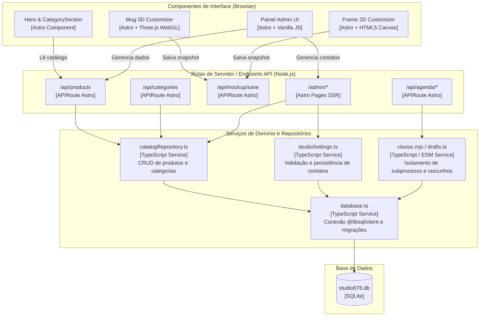

# Diagrama C4 — Componentes (Nível 3) — 678 Estudio

Decomposição dos componentes internos no servidor Astro e frontend.

```mermaid
flowchart TD
    subgraph ClientComponents["Componentes de Interface (Browser)"]
        HeroComp["Hero & CategorySection\n[Astro Component]"]
        MugComp["Mug 3D Customizer\n[Astro + Three.js WebGL]"]
        FrameComp["Frame 2D Customizer\n[Astro + HTML5 Canvas]"]
        AdminUI["Painel Admin UI\n[Astro + Vanilla JS]"]
    end

    subgraph ServerRoutes["Rotas de Servidor / Endpoints API (Node.js)"]
        ApiProducts["/api/products\n[APIRoute Astro]"]
        ApiCategories["/api/categories\n[APIRoute Astro]"]
        ApiMockup["/api/mockup/save\n[APIRoute Astro]"]
        ApiAgenda["/api/agenda/*\n[APIRoute Astro]"]
        AdminPages["/admin/*\n[Astro Pages SSR]"]
    end

    subgraph CoreServices["Serviços de Domínio e Repositórios"]
        CatalogRepo["catalogRepository.ts\n[TypeScript Service]\nCRUD de produtos e categorias"]
        StudioSettingsService["studioSettings.ts\n[TypeScript Service]\nValidação e persistência de contatos"]
        AgendaService["classic.mjs / drafts.ts\n[TypeScript / ESM Service]\nIsolamento de subprocesso e rascunhos"]
        DbService["database.ts\n[TypeScript Service]\nConexão @libsql/client e migrações"]
    end

    subgraph DB["Base de Dados"]
        SQLite[("studio678.db\n[SQLite]")]
    end

    MugComp -->|"Salva snapshot"| ApiMockup
    FrameComp -->|"Salva snapshot"| ApiMockup
    HeroComp -->|"Lê catálogo"| ApiProducts
    AdminUI -->|"Gerencia dados"| ApiProducts
    AdminUI -->|"Gerencia contatos"| AdminPages

    ApiProducts --> CatalogRepo
    ApiCategories --> CatalogRepo
    AdminPages --> StudioSettingsService
    AdminPages --> CatalogRepo
    ApiAgenda --> AgendaService

    CatalogRepo --> DbService
    StudioSettingsService --> DbService
    AgendaService --> DbService
    DbService --> SQLite
```

