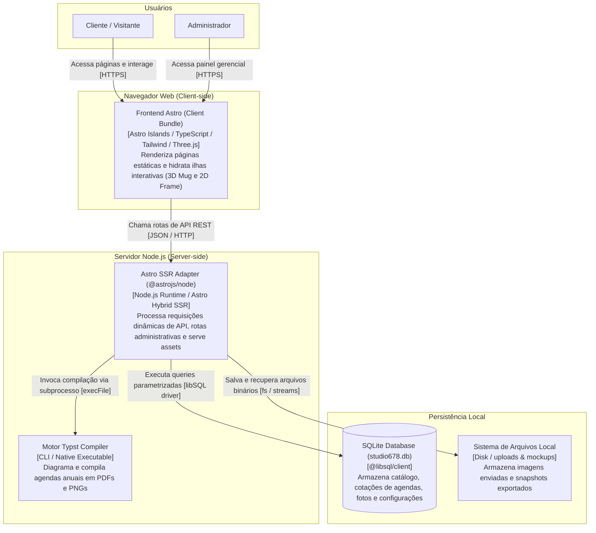

# Diagrama C4 — Contêineres (Nível 2) — 678 Estudio

Arquitetura de contêineres e tecnologias que compõem o ecossistema da aplicação.

```mermaid
flowchart TD
    subgraph Atores["Usuários"]
        User["Cliente / Visitante"]
        AdminUser["Administrador"]
    end

    subgraph Navegador["Navegador Web (Client-side)"]
        SPA["Frontend Astro (Client Bundle)\n[Astro Islands / TypeScript / Tailwind / Three.js]\nRenderiza páginas estáticas e hidrata ilhas interativas (3D Mug e 2D Frame)"]
    end

    subgraph Servidor["Servidor Node.js (Server-side)"]
        AstroServer["Astro SSR Adapter (@astrojs/node)\n[Node.js Runtime / Astro Hybrid SSR]\nProcessa requisições dinâmicas de API, rotas administrativas e serve assets"]
        AgendaEngine["Motor Typst Compiler\n[CLI / Native Executable]\nDiagrama e compila agendas anuais em PDFs e PNGs"]
    end

    subgraph Armazenamento["Persistência Local"]
        SQLiteDB[("SQLite Database (studio678.db)\n[@libsql/client]\nArmazena catálogo, cotações de agendas, fotos e configurações")]
        FileStorage["Sistema de Arquivos Local\n[Disk / uploads & mockups]\nArmazena imagens enviadas e snapshots exportados"]
    end

    User -->|"Acessa páginas e interage [HTTPS]"| SPA
    AdminUser -->|"Acessa painel gerencial [HTTPS]"| SPA

    SPA -->|"Chama rotas de API REST [JSON / HTTP]"| AstroServer
    AstroServer -->|"Executa queries parametrizadas [libSQL driver]"| SQLiteDB
    AstroServer -->|"Salva e recupera arquivos binários [fs / streams]"| FileStorage
    AstroServer -->|"Invoca compilação via subprocesso [execFile]"| AgendaEngine
```

