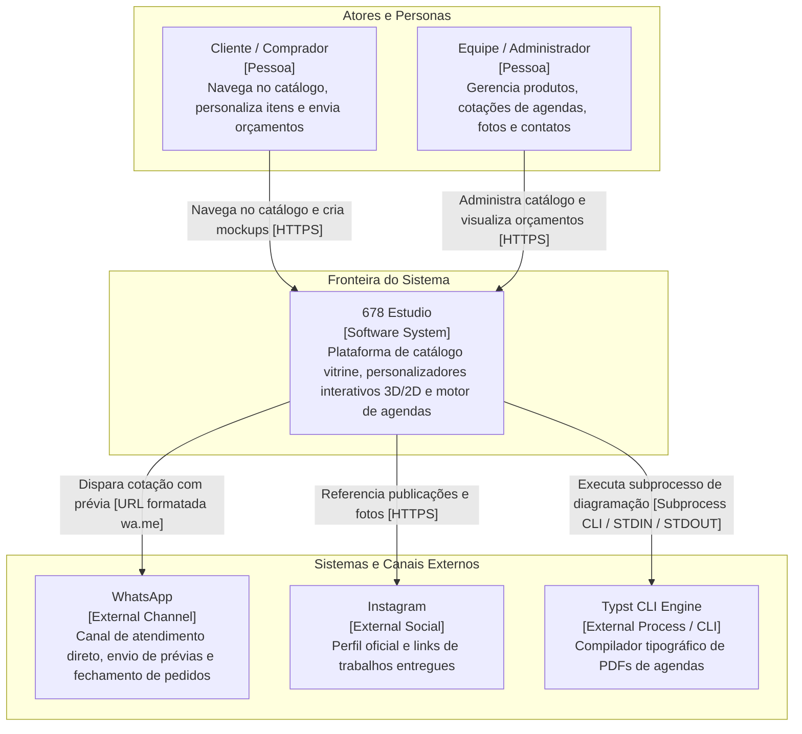

# Diagrama C4 — Contexto do Sistema (Nível 1) — 678 Estudio

Visão contextual dos atores externos, fronteiras do sistema e integrações.

```mermaid
flowchart TD
    subgraph Atores["Atores e Personas"]
        Client["Cliente / Comprador\n[Pessoa]\nNavega no catálogo, personaliza itens e envia orçamentos"]
        Admin["Equipe / Administrador\n[Pessoa]\nGerencia produtos, cotações de agendas, fotos e contatos"]
    end

    subgraph Sistema["Fronteira do Sistema"]
        StudioSys["678 Estudio\n[Software System]\nPlataforma de catálogo vitrine, personalizadores interativos 3D/2D e motor de agendas"]
    end

    subgraph Externos["Sistemas e Canais Externos"]
        WhatsApp["WhatsApp\n[External Channel]\nCanal de atendimento direto, envio de prévias e fechamento de pedidos"]
        Instagram["Instagram\n[External Social]\nPerfil oficial e links de trabalhos entregues"]
        TypstBin["Typst CLI Engine\n[External Process / CLI]\nCompilador tipográfico de PDFs de agendas"]
    end

    Client -->|"Navega no catálogo e cria mockups [HTTPS]"| StudioSys
    Admin -->|"Administra catálogo e visualiza orçamentos [HTTPS]"| StudioSys
    
    StudioSys -->|"Dispara cotação com prévia [URL formatada wa.me]"| WhatsApp
    StudioSys -->|"Referencia publicações e fotos [HTTPS]"| Instagram
    StudioSys -->|"Executa subprocesso de diagramação [Subprocess CLI / STDIN / STDOUT]"| TypstBin
```

