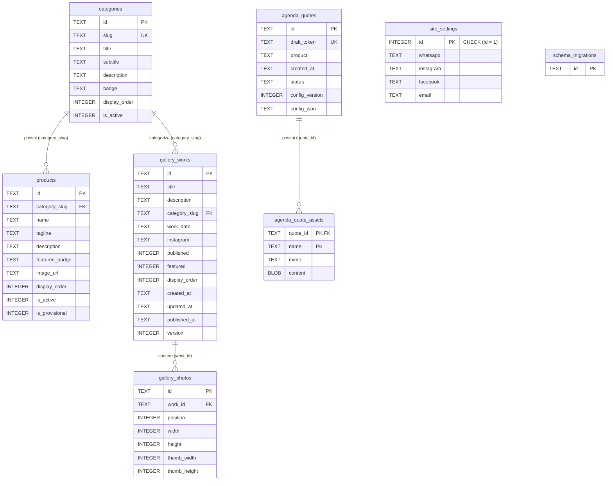

# Diagrama Entidade-Relacionamento Completo (ERD) — 678 Estudio

Diagrama relacional detalhado da base de dados SQLite (`studio678.db`).

```mermaid
erDiagram
    categories ||--o{ products : "possui (category_slug)"
    categories ||--o{ gallery_works : "categoriza (category_slug)"
    gallery_works ||--o{ gallery_photos : "contém (work_id)"
    agenda_quotes ||--o{ agenda_quote_assets : "possui (quote_id)"

    categories {
        TEXT id PK
        TEXT slug UK
        TEXT title
        TEXT subtitle
        TEXT description
        TEXT badge
        INTEGER display_order
        INTEGER is_active
    }

    products {
        TEXT id PK
        TEXT category_slug FK
        TEXT name
        TEXT tagline
        TEXT description
        TEXT featured_badge
        TEXT image_url
        INTEGER display_order
        INTEGER is_active
        INTEGER is_provisional
    }

    site_settings {
        INTEGER id PK "CHECK (id = 1)"
        TEXT whatsapp
        TEXT instagram
        TEXT facebook
        TEXT email
    }

    gallery_works {
        TEXT id PK
        TEXT title
        TEXT description
        TEXT category_slug FK
        TEXT work_date
        TEXT instagram
        INTEGER published
        INTEGER featured
        INTEGER display_order
        TEXT created_at
        TEXT updated_at
        TEXT published_at
        INTEGER version
    }

    gallery_photos {
        TEXT id PK
        TEXT work_id FK
        INTEGER position
        INTEGER width
        INTEGER height
        INTEGER thumb_width
        INTEGER thumb_height
    }

    agenda_quotes {
        TEXT id PK
        TEXT draft_token UK
        TEXT product
        TEXT created_at
        TEXT status
        INTEGER config_version
        TEXT config_json
    }

    agenda_quote_assets {
        TEXT quote_id PK, FK
        TEXT name PK
        TEXT mime
        BLOB content
    }

    schema_migrations {
        TEXT id PK
    }
```

