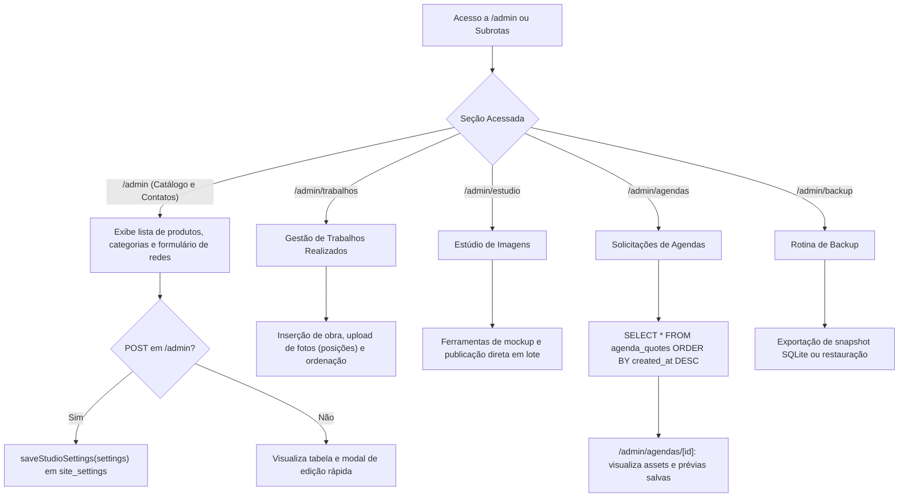

# Fluxograma — Módulo Admin

Painel de controle interno: catálogo, configurações de contato, trabalhos do portfólio, agendas e backups.

```mermaid
flowchart TD
    Req["Acesso a /admin ou Subrotas"] --> Section{"Seção Acessada"}
    
    Section -->|"/admin (Catálogo e Contatos)"| Cat["Exibe lista de produtos, categorias e formulário de redes"]
    Cat --> FormPost{"POST em /admin?"}
    FormPost -->|Sim| SaveSettings["saveStudioSettings(settings) em site_settings"]
    FormPost -->|Não| ViewCat["Visualiza tabela e modal de edição rápida"]
    
    Section -->|"/admin/trabalhos"| Gallery["Gestão de Trabalhos Realizados"]
    Gallery --> CRUDGallery["Inserção de obra, upload de fotos (posições) e ordenação"]
    
    Section -->|"/admin/estudio"| Studio["Estúdio de Imagens"]
    Studio --> Tools["Ferramentas de mockup e publicação direta em lote"]
    
    Section -->|"/admin/agendas"| Agendas["Solicitações de Agendas"]
    Agendas --> ViewQuotes["SELECT * FROM agenda_quotes ORDER BY created_at DESC"]
    ViewQuotes --> Detail["/admin/agendas/[id]: visualiza assets e prévias salvas"]
    
    Section -->|"/admin/backup"| Backup["Rotina de Backup"]
    Backup --> BackupAct["Exportação de snapshot SQLite ou restauração"]
```

