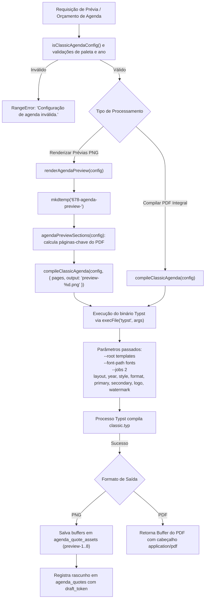

# Fluxograma — Módulo Agenda Compiler

Pipeline de compilação de agendas personalizadas em PDF e prévias PNG via subprocesso Typst CLI.

```mermaid
flowchart TD
    Req["Requisição de Prévia / Orçamento de Agenda"] --> Val["isClassicAgendaConfig() e validações de paleta e ano"]
    Val -->|Inválido| Err["RangeError: 'Configuração de agenda inválida.'"]
    
    Val -->|Válido| Action{"Tipo de Processamento"}
    
    Action -->|"Renderizar Prévias PNG"| Preview["renderAgendaPreview(config)"]
    Preview --> TempDir["mkdtemp('678-agenda-preview-')"]
    TempDir --> Secs["agendaPreviewSections(config): calcula páginas-chave do PDF"]
    Secs --> CompilePrev["compileClassicAgenda(config, { pages, output: 'preview-%d.png' })"]
    
    Action -->|"Compilar PDF Integral"| CompilePdf["compileClassicAgenda(config)"]
    
    CompilePrev --> TypstExec["Execução do binário Typst via execFile('typst', args)"]
    CompilePdf --> TypstExec
    
    TypstExec --> Args["Parâmetros passados:\n--root templates\n--font-path fonts\n--jobs 2\nlayout, year, style, format, primary, secondary, logo, watermark"]
    Args --> Subprocess["Processo Typst compila classic.typ"]
    
    Subprocess -->|Sucesso| Out{"Formato de Saída"}
    Out -->|PNG| SavePngs["Salva buffers em agenda_quote_assets (preview-1..8)"]
    Out -->|PDF| StreamPdf["Retorna Buffer do PDF com cabeçalho application/pdf"]
    
    SavePngs --> Draft["Registra rascunho em agenda_quotes com draft_token"]
```

