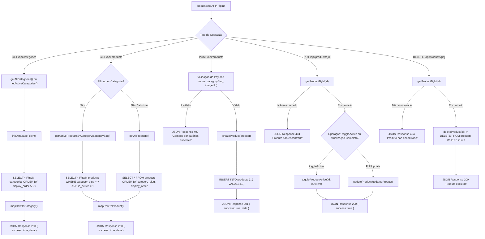

# Fluxograma — Módulo Catalog

Fluxo de consulta e manutenção de categorias e produtos no catálogo da 678 Estudio.

```mermaid
flowchart TD
    A["Requisição API/Página"] --> B{"Tipo de Operação"}
    
    B -->|"GET /api/categories"| C["getAllCategories() ou getActiveCategories()"]
    C --> C1["initDatabase(client)"]
    C1 --> C2["SELECT * FROM categories ORDER BY display_order ASC"]
    C2 --> C3["mapRowToCategory()"]
    C3 --> R1["JSON Response 200 { success: true, data }"]

    B -->|"GET /api/products"| D{"Filtrar por Categoria?"}
    D -->|Sim| D1["getActiveProductsByCategory(categorySlug)"]
    D -->|Não / all=true| D2["getAllProducts()"]
    D1 --> D3["SELECT * FROM products WHERE category_slug = ? AND is_active = 1"]
    D2 --> D4["SELECT * FROM products ORDER BY category_slug, display_order"]
    D3 --> D5["mapRowToProduct()"]
    D4 --> D5
    D5 --> R2["JSON Response 200 { success: true, data }"]

    B -->|"POST /api/products"| E["Validação de Payload (name, categorySlug, imageUrl)"]
    E -->|Inválido| E1["JSON Response 400 'Campos obrigatórios ausentes'"]
    E -->|Válido| E2["createProduct(product)"]
    E2 --> E3["INSERT INTO products (...) VALUES (...)"]
    E3 --> R3["JSON Response 201 { success: true, data }"]

    B -->|"PUT /api/products/[id]"| F["getProductById(id)"]
    F -->|Não encontrado| F1["JSON Response 404 'Produto não encontrado'"]
    F -->|Encontrado| F2{"Operação: toggleActive ou Atualização Completa?"}
    F2 -->|toggleActive| F3["toggleProductActive(id, isActive)"]
    F2 -->|Full Update| F4["updateProduct(updatedProduct)"]
    F3 --> R4["JSON Response 200 { success: true }"]
    F4 --> R4

    B -->|"DELETE /api/products/[id]"| G["getProductById(id)"]
    G -->|Não encontrado| G1["JSON Response 404 'Produto não encontrado'"]
    G -->|Encontrado| G2["deleteProduct(id) -> DELETE FROM products WHERE id = ?"]
    G2 --> R5["JSON Response 200 'Produto excluído'"]
```

