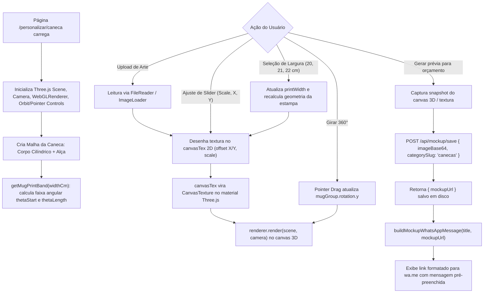

# Fluxograma — Módulo Customizer Caneca 3D

Fluxo de renderização 3D com Three.js, mapeamento de textura UV cilíndrica, exportação e integração com WhatsApp.

```mermaid
flowchart TD
    Init["Página /personalizar/caneca carrega"] --> SetupScene["Inicializa Three.js Scene, Camera, WebGLRenderer, Orbit/Pointer Controls"]
    SetupScene --> CreateMesh["Cria Malha da Caneca: Corpo Cilíndrico + Alça"]
    CreateMesh --> CalcUV["getMugPrintBand(widthCm): calcula faixa angular thetaStart e thetaLength"]
    
    UserAction{"Ação do Usuário"}
    
    UserAction -->|"Upload de Arte"| LoadImg["Leitura via FileReader / ImageLoader"]
    LoadImg --> UpdateTex["Desenha textura no canvasTex 2D (offset X/Y, scale)"]
    
    UserAction -->|"Ajuste de Slider (Scale, X, Y)"| UpdateTex
    UserAction -->|"Seleção de Largura (20, 21, 22 cm)"| RecalcBand["Atualiza printWidth e recalcula geometria da estampa"]
    RecalcBand --> UpdateTex
    
    UpdateTex --> ApplyTex["canvasTex vira CanvasTexture no material Three.js"]
    ApplyTex --> Render3D["renderer.render(scene, camera) no canvas 3D"]
    
    UserAction -->|"Girar 360°"| OrbitRot["Pointer Drag atualiza mugGroup.rotation.y"]
    OrbitRot --> Render3D
    
    UserAction -->|"Gerar prévia para orçamento"| ExportQuote["Captura snapshot do canvas 3D / textura"]
    ExportQuote --> SaveMockup["POST /api/mockup/save { imageBase64, categorySlug: 'canecas' }"]
    SaveMockup --> GetUrl["Retorna { mockupUrl } salvo em disco"]
    GetUrl --> GenWa["buildMockupWhatsAppMessage(title, mockupUrl)"]
    GenWa --> OpenWa["Exibe link formatado para wa.me com mensagem pré-preenchida"]
```

