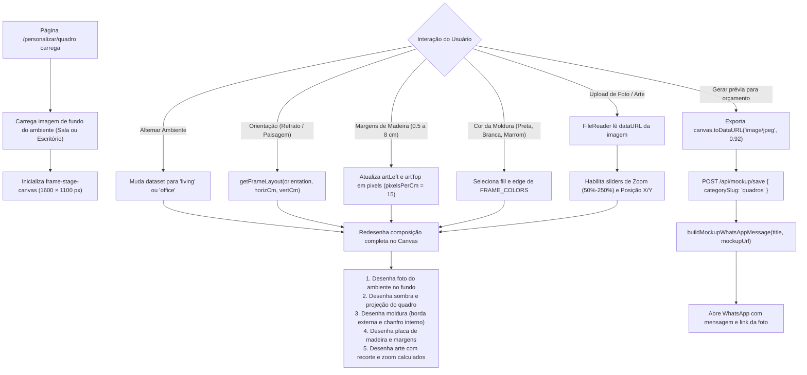

# Fluxograma — Módulo Customizer Quadro Ambiente

Simulação contextual 2D de quadros em madeira clara com moldura e arte sublimada em ambientes de sala e escritório.

```mermaid
flowchart TD
    Init["Página /personalizar/quadro carrega"] --> LoadBase["Carrega imagem de fundo do ambiente (Sala ou Escritório)"]
    LoadBase --> SetupCanvas["Inicializa frame-stage-canvas (1600 × 1100 px)"]
    
    UserAction{"Interação do Usuário"}
    
    UserAction -->|"Alternar Ambiente"| SwitchEnv["Muda dataset para 'living' ou 'office'"]
    SwitchEnv --> RenderStage["Redesenha composição completa no Canvas"]
    
    UserAction -->|"Orientação (Retrato / Paisagem)"| SetOrient["getFrameLayout(orientation, horizCm, vertCm)"]
    SetOrient --> RenderStage
    
    UserAction -->|"Margens de Madeira (0.5 a 8 cm)"| SetMargins["Atualiza artLeft e artTop em pixels (pixelsPerCm = 15)"]
    SetMargins --> RenderStage
    
    UserAction -->|"Cor da Moldura (Preta, Branca, Marrom)"| SetColor["Seleciona fill e edge de FRAME_COLORS"]
    SetColor --> RenderStage
    
    UserAction -->|"Upload de Foto / Arte"| ReadFile["FileReader lê dataURL da imagem"]
    ReadFile --> SetScale["Habilita sliders de Zoom (50%-250%) e Posição X/Y"]
    SetScale --> RenderStage
    
    RenderStage --> DrawSteps["1. Desenha foto do ambiente no fundo\n2. Desenha sombra e projeção do quadro\n3. Desenha moldura (borda externa e chanfro interno)\n4. Desenha placa de madeira e margens\n5. Desenha arte com recorte e zoom calculados"]
    
    UserAction -->|"Gerar prévia para orçamento"| Export["Exporta canvas.toDataURL('image/jpeg', 0.92)"]
    Export --> SaveMockup["POST /api/mockup/save { categorySlug: 'quadros' }"]
    SaveMockup --> WaMsg["buildMockupWhatsAppMessage(title, mockupUrl)"]
    WaMsg --> OpenWa["Abre WhatsApp com mensagem e link da foto"]
```

