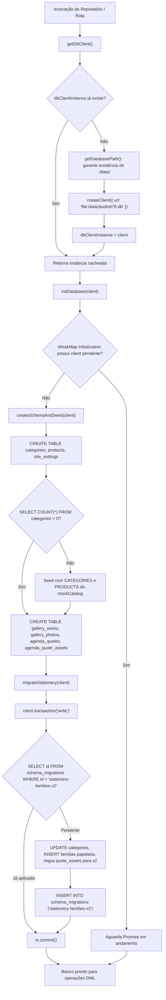

# Fluxograma — Módulo Database

Ciclo de vida de conexão, inicialização idempotente e migrações no banco SQLite (`studio678.db`) via `@libsql/client`.

```mermaid
flowchart TD
    Start["Invocação de Repositório / Rota"] --> GetClient["getDbClient()"]
    GetClient --> InstanceCheck{"dbClientInstance já existe?"}
    InstanceCheck -->|Sim| ReturnClient["Retorna instância cacheada"]
    InstanceCheck -->|Não| ResolveDir["getDatabasePath(): garante existência de ./data/"]
    ResolveDir --> CreateLibsql["createClient({ url: 'file:data/studio678.db' })"]
    CreateLibsql --> SetInstance["dbClientInstance = client"]
    SetInstance --> ReturnClient

    ReturnClient --> InitDb["initDatabase(client)"]
    InitDb --> WeakMapCheck{"WeakMap initialization possui client pendente?"}
    WeakMapCheck -->|Sim| WaitPromise["Aguarda Promise em andamento"]
    WeakMapCheck -->|Não| RunInit["createSchemaAndSeed(client)"]
    
    RunInit --> Tables1["CREATE TABLE categories, products, site_settings"]
    Tables1 --> SeedCheck{"SELECT COUNT(*) FROM categories > 0?"}
    SeedCheck -->|Não| Seed["Seed com CATEGORIES e PRODUCTS do mockCatalog"]
    SeedCheck -->|Sim| Tables2["CREATE TABLE gallery_works, gallery_photos, agenda_quotes, agenda_quote_assets"]
    Seed --> Tables2
    
    Tables2 --> RunMigrations["migrateStationery(client)"]
    RunMigrations --> TxBegin["client.transaction('write')"]
    TxBegin --> MigCheck{"SELECT id FROM schema_migrations WHERE id = 'stationery-families-v2'"}
    MigCheck -->|Já aplicada| TxCommit["tx.commit()"]
    MigCheck -->|Pendente| ApplyMig["UPDATE categories, INSERT famílias papelaria, migra quote_assets para v2"]
    ApplyMig --> RecordMig["INSERT INTO schema_migrations ('stationery-families-v2')"]
    RecordMig --> TxCommit
    
    TxCommit --> Ready["Banco pronto para operações DML"]
    WaitPromise --> Ready
```

