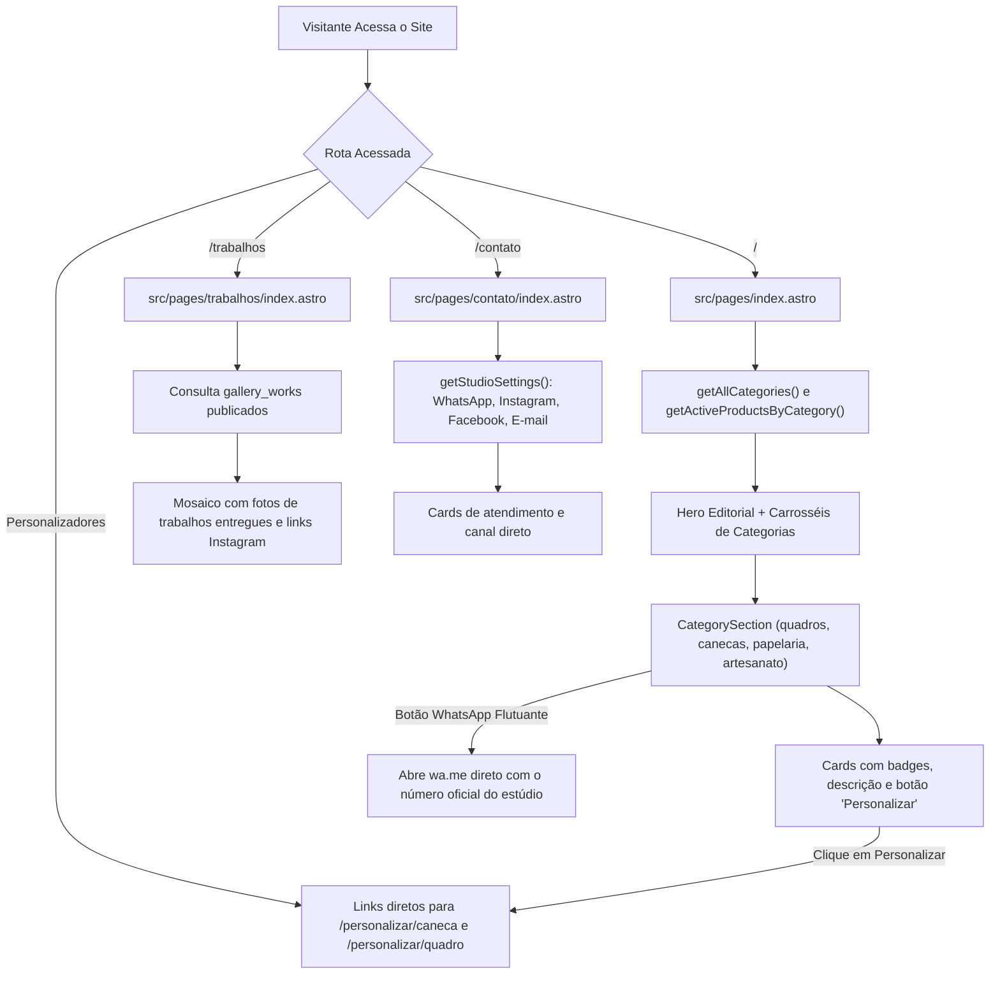

# Fluxograma — Módulo Public Site

Navegação pública, renderização do catálogo vitrine, portfólio de trabalhos e pontos de contato.

```mermaid
flowchart TD
    User["Visitante Acessa o Site"] --> Page{"Rota Acessada"}
    
    Page -->|"/"| Home["src/pages/index.astro"]
    Home --> FetchCat["getAllCategories() e getActiveProductsByCategory()"]
    FetchCat --> RenderHero["Hero Editorial + Carrosséis de Categorias"]
    RenderHero --> CategorySection["CategorySection (quadros, canecas, papelaria, artesanato)"]
    CategorySection --> ProductCard["Cards com badges, descrição e botão 'Personalizar'"]
    
    Page -->|"/trabalhos"| Portfolio["src/pages/trabalhos/index.astro"]
    Portfolio --> FetchWorks["Consulta gallery_works publicados"]
    FetchWorks --> RenderGallery["Mosaico com fotos de trabalhos entregues e links Instagram"]
    
    Page -->|"/contato"| Contact["src/pages/contato/index.astro"]
    Contact --> FetchSettings["getStudioSettings(): WhatsApp, Instagram, Facebook, E-mail"]
    FetchSettings --> RenderContact["Cards de atendimento e canal direto"]
    
    Page -->|"Personalizadores"| Redirect["Links diretos para /personalizar/caneca e /personalizar/quadro"]
    
    ProductCard -->|"Clique em Personalizar"| Redirect
    CategorySection -->|"Botão WhatsApp Flutuante"| WaDirect["Abre wa.me direto com o número oficial do estúdio"]
```

